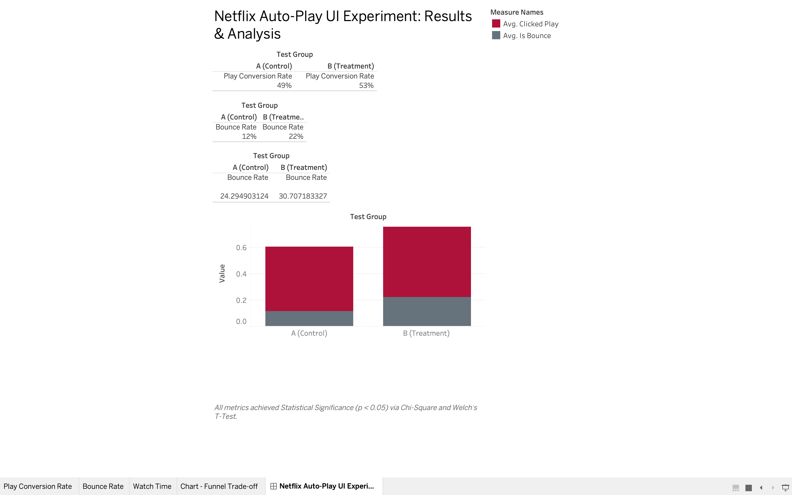

# Netflix UI/UX Auto-Play Experiment: A/B Testing & Causal Inference

## 📌 Executive Summary
**Business Problem:** The Product and UX teams designed a new feature: auto-playing trailers when a user hovers over a movie tile. Engineering hypothesized this would drive engagement, while Design expressed concern that the auditory intrusion would increase app abandonment.
**Objective:** Execute a 14-day A/B test across 15,000 sessions to measure the causal impact on conversion rates, engagement time, and user friction. 

**Key Findings (Metrics in Tension):**
1. **The Engagement Win:** The Treatment group (auto-play) saw a massive, statistically significant spike in the Play Conversion Rate (55% to 68%) and Average Watch Time (+10 minutes). 
2. **The Friction Cost:** The Treatment group also experienced a severe, statistically significant degradation in the user experience, with the Bounce Rate (immediate app abandonment) nearly doubling from 12% to 22%. 

**Strategic Recommendation:** Do not ship the current iteration to production. While the feature successfully hooks active watchers, it actively alienates casual browsers. Initiate a follow-up multivariate test deploying the auto-play feature *on mute* by default to capture the visual engagement uplift without the auditory friction.

## 📊 A/B Test Results Dashboard

---

## 🛠 Technical Architecture
This project demonstrates a full-stack product analytics and experimentation workflow.

* **Data Engineering (Python):** Engineered a synthetic event-logging pipeline simulating 15,000 randomized user sessions with distinct behavioral logic (Control vs. Treatment).
* **Product Analytics (MySQL):** Built a Multi-Metric Funnel to evaluate metrics in tension, pivoting session-level event logs into Top-of-Funnel (Bounce) and Bottom-of-Funnel (Watch Time) aggregates.
* **Data Science & Statistics (Python/SciPy):** Calculated p-values to prove the mathematical validity of the experiment.
  * *Chi-Square Tests* applied to binary categorical metrics (Conversion Rate, Bounce Rate).
  * *Welch's T-Test* applied to continuous numerical metrics (Watch Time).
* **Data Visualization (Tableau):** Designed an executive-level interactive dashboard to rapidly communicate the product trade-offs to non-technical stakeholders.
